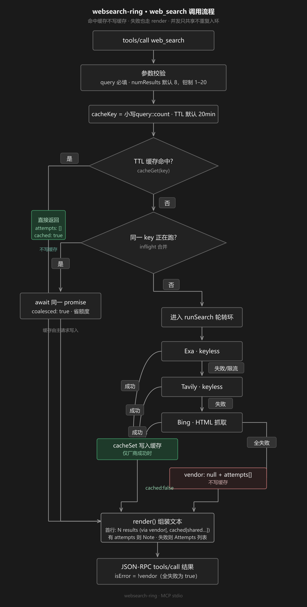

# websearch-ring

[](https://github.com/TWFU-wcy/websearch-ring/actions/workflows/ci.yml)
[](https://github.com/TWFU-wcy/websearch-ring/releases)
[](LICENSE)

**多后端轮询 · 自动故障转移 · Keyless 优先** 的网页搜索 MCP Server。

一份 `index.js`，零 npm 依赖，接到任意支持 **stdio MCP** 的客户端即可稳定联网搜索——不绑模型、不绑厂商、不强制 API Key。

```text
3 results for "杭州周末天气" (via exa, cached)
1. 杭州天气预报…
   https://…
```

首行标明实际来源（`via exa` / `tavily` / `bing`），以及是否命中缓存（`, cached`）或被并发合并（`, shared with a concurrent call`）。

---

## 为什么需要它

| 痛点 | websearch-ring 的做法 |
|------|------------------------|
| 单一搜索 API 挂了 / 限流 | 按环顺序自动换下一家 |
| 不想管一堆 API Key | 默认 keyless 通道开箱即用 |
| 同样 query 被子代理打爆 | TTL 缓存 + 相同并发请求合并 |
| 出站带用户标识 | **请求不携带任何用户标识** |
| 换模型后内置 websearch 不可用 | 独立 stdio MCP，客户端无关 |

---

## 特性

- ✅ **厂商轮盘**：默认 `exa → tavily → bing`，失败 / 超时 / 限流自动 failover
- ✅ **Keyless 优先**：可选 `EXA_API_KEY` / `TAVILY_API_KEY` 提额度
- ✅ **TTL 缓存**：默认 20 分钟（`WEBSEARCH_TTL_MS`）
- ✅ **并发合并**：相同 query 并发只打一次后端
- ✅ **可审计**：via 来源 + 失败 attempts + 截断标记
- ✅ **单文件**：约 400 行，无构建、无 dependencies

---

## 快速开始

### 1. 冒烟测试（可选）

```bash
node smoke-test.mjs "杭州周末天气"
```

预期：第一次结果**无** `cached`，相同参数第二次含 **`(via …, cached)`**。

### 2. 接入（两种通用方式）

路径改成你机器上的绝对路径。

**方式 A — CLI（例：Claude Code）**

```bash
claude mcp add websearch-ring -- node /absolute/path/to/websearch-ring/index.js
```

**方式 B — 通用 `mcpServers` JSON**  
（Claude Desktop、Cursor 等；Codex 等 TOML 客户端把同样字段改成对应格式即可）

```json
{
  "mcpServers": {
    "websearch-ring": {
      "command": "node",
      "args": ["/absolute/path/to/websearch-ring/index.js"],
      "env": {
        "WEBSEARCH_VENDORS": "exa,tavily,bing",
        "WEBSEARCH_TIMEOUT_MS": "12000",
        "WEBSEARCH_TTL_MS": "1200000",
        "WEBSEARCH_MAX_CHARS": "12000"
      }
    }
  }
}
```

任何支持 **command + args + env** 的 MCP 客户端都是同一套路。

---

## 环境变量（全部可选）

| 变量 | 默认 | 说明 |
|------|------|------|
| `WEBSEARCH_VENDORS` | `exa,tavily,bing` | 轮转顺序 |
| `WEBSEARCH_TIMEOUT_MS` | `12000` | 单厂商超时 |
| `WEBSEARCH_MAX_CHARS` | `12000` | 返回文本上限 |
| `WEBSEARCH_TTL_MS` | `1200000` | 缓存 TTL；`0` 关闭 |
| `EXA_API_KEY` | （空） | 空则 keyless |
| `TAVILY_API_KEY` | （空） | 空则 keyless |
| `WEBSEARCH_UA` | Chrome UA | Bing 抓取 UA |

---

## 调用流程

<p align="center">
  
</p>

要点：

1. **优先级**：缓存命中 → inflight 合并 → 新跑轮转（不可颠倒）
2. **缓存命中**：不写缓存、不续 TTL；`attempts: []` + `cached: true` 直接 `render`
3. **仅厂商成功** 时 `cacheSet`；合并方与全失败都不写
4. **全失败**：正常返回 `vendor: null` + `attempts`，仍走 `render`，`isError: true`
5. **标记**：`cached` > `coalesced`（shared）> 空；有失败才出 Note 行

---

## 工具接口

**Tool:** `web_search`

| 参数 | 类型 | 必填 | 说明 |
|------|------|------|------|
| `query` | string | ✅ | 搜索词 |
| `numResults` | integer | | 默认 8，钳制 1–20 |

---

## 与同类方案的差异

1. **最轻**：单文件、零依赖
2. **Keyless-first**，可选补 Key
3. **缓存 + 并发合并** 同时具备
4. **via / attempts 透明**

> **最轻量的高可用搜索环：一份 index.js，exa→tavily→bing 自动故障转移 + TTL 缓存 + 并发合并。**

---

## 许可证

MIT
